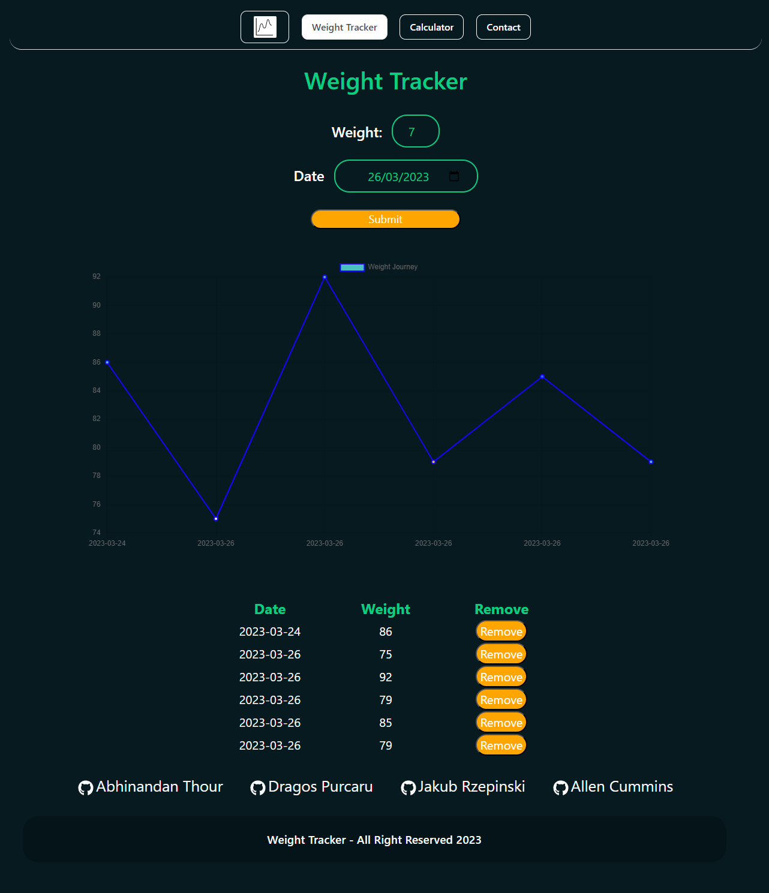

# Weight-Tracker

## Description

This application is designed to keep track of a user's health by storing vital information concerning their physical well-being.
Information such as weight, height, age, as well as calories intake will be used to help the user keep track of their health journey

Using the application on a daily basis can help the user make decisions regarding adjustments to their lifestyle in order to increase or maintain their health.

## Usage

The application has been made for a specific user that wants to keep track of his daily weight, the user can simply open the linked website and start using it right away by simply logging in his daily weight!! With more data points, the user will see the progress of his weight journey!

The user also has the ability to get a suggested Diet based on his daily calorie intake and if he wants to lose, maintain or gain weight!

## Deployment

The deployed application can be found here: https://gentle-licorice-8a4df1.netlify.app/

## Credits

* [Abhinandan Thour](https://github.com/Bh00fie)  
* [Allen Cummins](https://github.com/Allen-EC)  
* [Jakub Rzepinski](https://github.com/rzepa000)  
* [Dragos Purcaru](https://github.com/DrGoshD)  

## Technologies used in the application.

This project has been built in reactJS.

Different Technologies were used in the making of this project, which:
* EmailJS
* ChartJS
* React-Icon
* React Router
* Material UI
* EmotionsJS
* Bootstrap

## Licence

Please refer to the LICENCE in the Repository.

---

